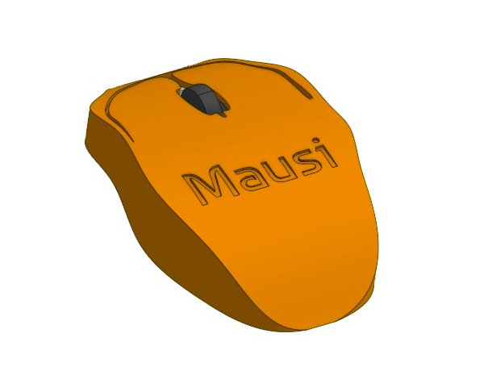
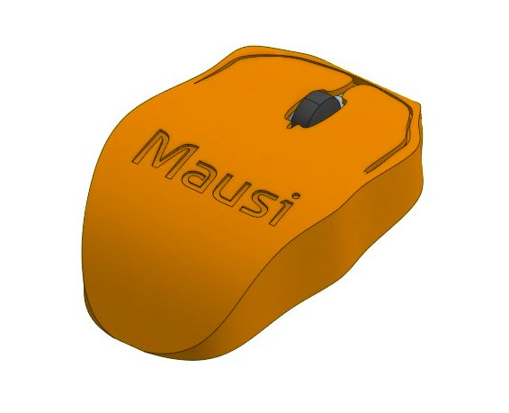
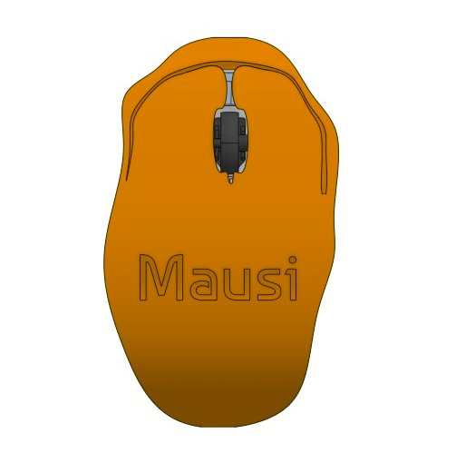
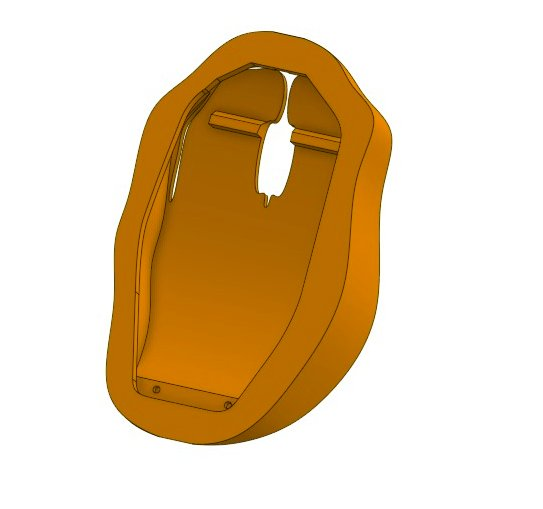

# Mausi
A precision fitted enclosure designed around the Bambu Lab Wireless Mouse Components Kit it includes button openings, a scroll wheel slot, and screw hole placements
## Purpose
I made this project to learn Onshape, a free online CAD tool. My goal was to practice designing cases and enclosures that fit around real circuit boards and hardware parts
## Assembly
1. Place the mouse PCB and battery into the bottom shell
2. Align the buttons and scroll wheel with their respective cutouts
3. Line up the screw holes and fasten the screws to secure everything in place
## Images 

  
  
  
  

## Bill of Material
| Name | Qty | Price in USD | Link |
| --- | --- | ---- | --- |
| Bambu Lab Mouse Kit | 1 | $13 | [HERE](https://us.store.bambulab.com/products/wireless-mouse-components-kit-002) |
| Custom Case | 1 | $5 | N/A |
| Shipping Cost & Taxes | - | $7 | N/A |
|   | Total | $25 |   |